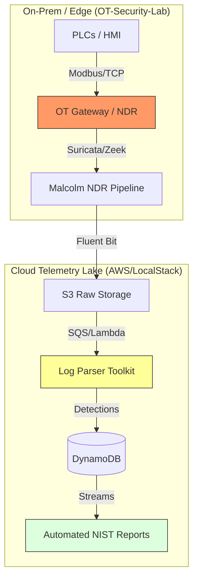

# Liam Carvajal
**Security Engineer | OT/ICS & Cloud Detection Engineering**

I build end-to-end security architectures for critical infrastructure. My focus is on bridging the gap between legacy industrial protocols (Modbus, S7comm) and modern cloud-native detection pipelines.

[LinkedIn](https://www.linkedin.com/in/liam-carvajal-perez/) · [Email](mailto:carvajalperezliam7@gmail.com) · Based in Spain (Open to Remote Europe/USA)

---

## 🏗️ Integrated OT, Cloud & Analytics Ecosystem
I don't just build security tools; I engineer the data pipelines required to ingest, structure, and analyze high-volume industrial telemetry for advanced heuristics and ML modeling.

---

## 🛠️ Featured Projects

### [Cloud Telemetry Lake](https://github.com/LiamCarPer/cloud-telemetry-lake)
**The Problem:** Ingesting OT telemetry into AWS is often rigid and expensive.
**The Solution:** A serverless, event-driven pipeline that ingests, parses, and archives OT security events in real-time.
*   **Engineering Challenge:** Solved LocalStack Community constraints by implementing a **Fat-Zip dependency injection** at cold-start and a **dynamic gzip detection** layer for Fluent Bit payloads.
*   **Stack:** Terraform, AWS Lambda, DynamoDB, S3, Snappy/Parquet, Fluent Bit.

### [OT-NDR-Malcolm-Pipeline](https://github.com/LiamCarPer/OT-NDR-Malcolm-Pipeline)
**The Problem:** Commercial NDR (Nozomi/Claroty) is cost-prohibitive for many facilities.
**The Solution:** A production-grade NDR pipeline using CISA Malcolm, Arkime, and Suricata, enriched by a custom **Python SOAR layer**.
*   **Impact:** Implemented automated **DPI profiling** of Modbus function codes to identify unauthorized register manipulation before it hits the SIEM.
*   **Stack:** CISA Malcolm, Arkime, Suricata, Python (Scapy/Tshark).

### [OT-Security-Lab](https://github.com/LiamCarPer/OT-Security-Lab)
**The Problem:** You can't test attacks on live water treatment plants.
**The Solution:** A 5-zone Docker-based simulation of a water filtration facility mapped to the **Purdue Model** and **IEC 62443**.
*   **Engineering Judgment:** Isolated the Historian in Level 3 to enforce unidirectional data flow, fulfilling IEC 62443 requirements for zone-to-zone restricted access.
*   **Stack:** OpenPLC, Scada-LTS, Iptables (Zone Firewall), InfluxDB, Grafana.

### [Log Parser Toolkit](https://github.com/LiamCarPer/log-parser-toolkit)
**The Problem:** SIEM ingestion is only as good as its parser.
**The Solution:** A memory-efficient, stateful parsing engine for unstructured logs.
*   **Technical Nuance:** Uses the **Generator pattern** to process multi-gigabyte logs with near-zero RAM overhead. Features a stateful middleware for correlating SSH brute force and web scanning across time windows.

---

## 🛡️ Security Philosophy
*   **Availability is Paramount:** In OT, a False Positive that triggers a block can be more dangerous than the attack itself. I focus on high-fidelity, physics-aware detection.
*   **Threat-Informed Defense:** Every detection rule I write is mapped to **MITRE ATT&CK for ICS** (T0831, T0846, T0886) to ensure coverage of actual adversary TTPs.
*   **Evidence over Opinions:** I value raw PCAPs, verified attack logs, and NIST-aligned incident reports over "box-ticking" compliance.

---

## 🧠 Applied AI & Analytical Philosophy

*   **Data Quality is Paramount:** I focus heavily on the data engineering lifecycle. A predictive model in OT is useless without low-latency, highly structured telemetry.
*   **Physics-Aware Modeling:** False positives in ICS cost downtime. I emphasize high-fidelity feature engineering (e.g., mapping TTPs to MITRE ATT&CK for ICS) to ensure models understand actual industrial context, not just statistical noise.
*   **Research & Application:** Continuously researching the intersection of Deep Learning and Cybersecurity, including time-series anomaly detection and integrating LLMs (RAG) for automated incident response contextualization.

---

## 🧰 Technical Arsenal

*   **AI/ML & Data Engineering:** Python (Pandas, PyTorch/Scikit-learn, Pytest), Time-Series Analysis, Jupyter, LLM Integration, Data Lakes (Parquet).
*   **Cloud & Infrastructure:** AWS (Lambda, S3, DynamoDB, Athena), Terraform, Docker/Compose, LocalStack.
*   **OT Security:** Malcolm NDR, Zeek, Scapy, Modbus/TCP, S7comm, Syslog & Event parsing.

---

## 📈 Professional Development
*   **Aligning with Industry Standards:** Actively hardening expertise via **GICSP** (Global Industrial Cyber Security Professional), **BTL1**, and **Security+**.
*   **Focus:** Advancing my knowledge in Cloud-Native SIEM (Sentinel/Chronicle) and ICS Adversary Emulation (TRITON/Industroyer).

---

## 🤝 Let's Collaborate

While my full-time focus is defending critical OT architectures, I spend my evenings and weekends immersed in the applied AI/ML community.

I am highly active in the broader engineering space and am always open to connecting regarding joint research initiatives, open-source collaborations, and technical advisory on data engineering and predictive modeling challenges. Whether it's architecting a robust data pipeline or exploring models for anomaly detection, feel free to reach out!
