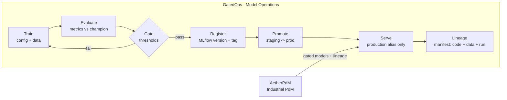

# Liam Carvajal

**MLOps & Industrial ML | Gated model promotion · Predictive maintenance · OT-domain systems**

I build production ML systems where a model only reaches production by passing an enforceable quality gate, every prediction carries its lineage back to code, data, and training run, and the metrics match the real cost of being wrong. My domain context comes from OT/ICS environments — I treat industrial signals (vibration, protocols, physics) as first-class features, not noise.

[LinkedIn](https://www.linkedin.com/in/liam-carvajal-perez/) · [Email](mailto:carvajalperezliam7@gmail.com) · Based in Spain (Open to Remote Europe/USA)

---

## The Loop

GatedOps is the operations layer: train → evaluate → gate → register → promote → serve, with lineage on every prediction. AetherPdM is the vertical that consumes the same contract for industrial predictive maintenance.

---

## Featured Projects

### [GatedOps](https://github.com/LiamCarPer/GatedOps)
**The Problem:** Most teams can train a model; few have a system where a bad model cannot be promoted and every prediction can be traced to its code, data, and training run.
**The Solution:** A reference MLOps platform — gated train/evaluate/promote/serve with full lineage. Models pass threshold gates vs. the champion before they can be registered (MLflow) and promoted (staging → production alias only); a CI workflow fails the pipeline with a `GateReport` when a model does not clear the bar.
*   **Engineering Challenge:** An MLflow-free gate engine with challenger/champion rules — generic over any `predict_proba` model, and identical locally, in CI, and against the production stack.
*   **Stack:** Python, MLflow, FastAPI, Docker Compose, uv, pytest, GitHub Actions.

### [AetherPdM](https://github.com/LiamCarPer/AetherPdM)
**The Problem:** Unplanned downtime in rotating equipment costs billions annually, and 40-60% of maintenance alerts are noise — rule-based thresholds don't adapt to load or operating conditions.
**The Solution:** End-to-end predictive maintenance: vibration waveforms → domain-aware signal features → anomaly score + fault classification → REST serving with model versioning, lineage, and operator-facing explanations.
*   **Engineering Challenge:** Anti-leakage train/test splits, and physics-informed features (envelope analysis, BPFO/BPFI/BSF, band power) that separate real bearing faults from statistical noise.
*   **Stack:** Python, scikit-learn, SciPy, FastAPI, MLflow, Parquet, Docker, uv, pytest, GitHub Actions.

### [OT-Security-Lab](https://github.com/LiamCarPer/OT-Security-Lab)
**The Problem:** You can't test attacks on live water treatment plants.
**The Solution:** A 5-zone Docker lab mapped to the Purdue Model and IEC 62443 — protocol-aware detection (Modbus DPI, DNP3), a physics-aware safety monitor that shadows PLC state, and a Grafana/Loki SIEM with SOAR-lite automation.
*   **Engineering Judgment:** The pipeline is machine-verified end to end: 10 CI gates plus a Compliance Gate that boots the lab, replays attack simulations, and **commits fresh detection evidence on every green run**; SBOMs are keyless-signed via Sigstore. This is where I learned that in OT, a false positive costs more than a miss — the same principle now drives my ML metric design.
*   **Stack:** Docker, OpenPLC, Scada-LTS, Scapy, DNP3, Grafana/Loki, OPA/conftest, GitHub Actions. [Live site](https://liamcarper.github.io/OT-Security-Lab/) · v1.0.1

---

## Also

- [Cloud Telemetry Lake](https://github.com/LiamCarPer/cloud-telemetry-lake) — serverless OT telemetry ingest (Terraform, Lambda, S3, DynamoDB, Fluent Bit)
- [OT-NDR-Malcolm-Pipeline](https://github.com/LiamCarPer/OT-NDR-Malcolm-Pipeline) — CISA Malcolm NDR with a custom Modbus DPI SOAR layer
- [ICS Agentic SOC Pipeline](https://github.com/LiamCarPer/ics-agentic-soc-pipeline) — agentic, NIST-aligned incident reporting (LangGraph, RAG, Isolation Forest)
- [Log Parser Toolkit](https://github.com/LiamCarPer/log-parser-toolkit) — generator-based log parsing with near-zero RAM overhead
- [rust-security-toolkit](https://github.com/LiamCarPer/rust-security-toolkit) & [solana-audit-toolkit](https://github.com/LiamCarPer/solana-audit-toolkit) — Rust/Solana program auditing tooling

---

## How I Build ML Systems

- **Gates before production:** a model that fails its quality bar cannot be promoted — the gate proves it, in CI, with artifact-hash integrity.
- **Domain metrics over vanity accuracy:** I design metrics to match the cost of being wrong (false-alarm rate, downtime) — the availability-first mindset I learned in OT.
- **Lineage and reproducibility:** every served prediction traces to its exact code, data, and training run; promote/serve is explicit and reversible.
- **OT literacy as context:** industrial protocols and physics-aware signals (envelope, BPFO, process state) inform how I structure features — not just what I train on.

---

## Stack

**MLOps & Data**
         

**Cloud & Infrastructure**
       

**OT Domain**
         

---

## Professional Development

- **Now:** MLOps platform practice — gated promotion, model lineage, cloud ML deployment — and industrial ML on vibration/rotating-equipment signals.
- **Background:** OT/ICS security engineering — IEC 62443 zones and conduits, MITRE ATT&CK for ICS detection mapping, protocol-aware detection, DevSecOps pipelines.

---

## Open to

Building production ML systems — gating, lineage, industrial predictive maintenance — with a background in OT/ICS environments. Open to **MLOps / ML Platform / Industrial ML** roles, remote within Europe/USA. If you're building model infrastructure or industrial analytics, let's talk.
