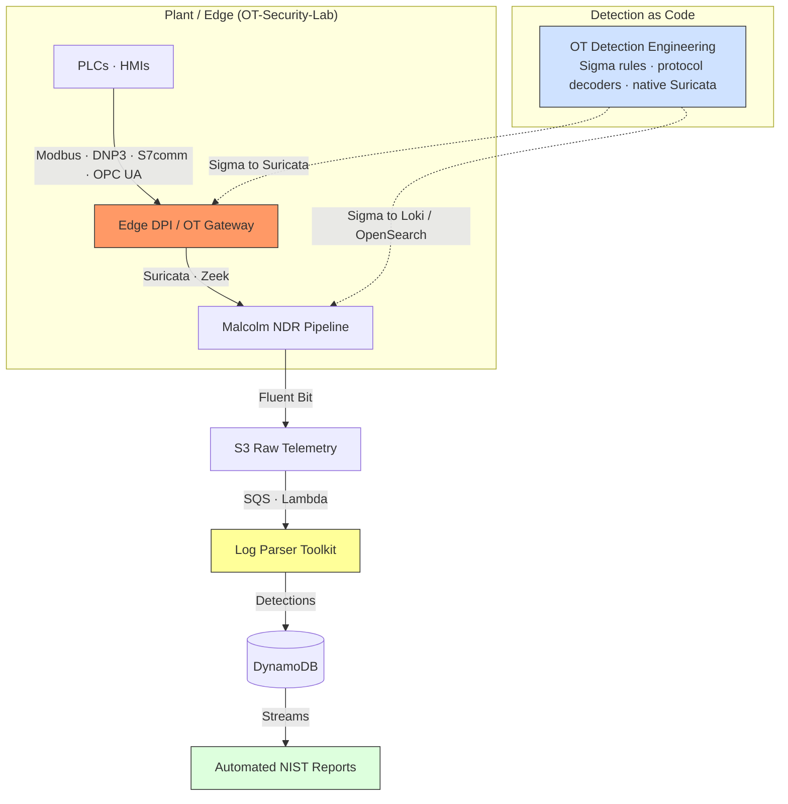

# Liam Carvajal

**OT Detection Engineer | Detection-as-Code · OT NDR · MITRE ATT&CK for ICS**

I build OT detection that holds up in a real plant. That means content written once and generated everywhere, rules that understand what a Modbus function code or a DNP3 operate actually does, and coverage measured against adversary emulation instead of guessed at. Architecture is part of that job too — zones and conduits, IT/OT segmentation and DMZ design, secure remote access — because a detection is only ever as good as the telemetry the network lets through. I work across legacy industrial protocols (Modbus, PROFINET, DNP3, OPC UA, IEC 61850) and the brownfield reality of adding monitoring to a running facility.

Currently **OT Security Analyst (Incident Response & Threat Hunting) @ Rockwell Automation** — industrial detection, threat hunting and incident response in production OT environments.

[LinkedIn](https://www.linkedin.com/in/liam-carvajal-perez/) · [Email](mailto:carvajalperezliam7@gmail.com) · Spain · **Open to EU remote & B2B / contract engagements**

---

## 🔍 How detection reaches the plant

The rule source is the center of gravity. Everything downstream — edge sensors, SIEM queries, coverage metrics — is generated from it, so nothing drifts and no rule is deployed by hand.

---

## 🛡️ Detection Engineering at a Glance

*   **Rules as software** — pySigma-based validation over a parsed rule model, positive/negative fixtures, and structural governance for native Suricata rules.
*   **Protocol-aware content** — application-layer detections for Modbus, DNP3, S7comm and OPC UA, backed by Rust decoders rather than fragile byte offsets.
*   **Coverage you can prove** — ATT&CK for ICS coverage and MTTD / false-positive metrics derived from the rules themselves, never hand-maintained.
*   **Proven, not assumed** — content exercised against adversary emulation and a live lab run before it is trusted.
*   **One rule, many consumers** — Splunk, Microsoft Sentinel, OpenSearch and Grafana Loki queries all generated from a single source of truth.

---

## 🎯 Featured Work

### [OT Detection Engineering](https://github.com/LiamCarPer/ot-detection-engineering)
**The Problem:** OT detection content is written once, deployed by hand, duplicated across the SIEM and the NDR, and never measured — so nobody can say which ATT&CK for ICS techniques are covered, how fast detections fire, or whether a rule change broke one.
**The Solution:** A detection-as-code pipeline that treats detections as software: OT Sigma rules and native protocol DPI (Modbus, DNP3, S7comm, OPC UA), with Rust DNP3, S7comm and OPC UA decoders for application-layer events, validated and converted in CI from a single source of truth, proven against adversary emulation and deployed into a Malcolm NDR pipeline and the OT-Security-Lab Loki stack.
*   **Detection Engineering:** Built a pySigma-based validation matcher over the parsed rule model, labeled positive/negative fixtures, and structural governance for native Suricata rules. ATT&CK for ICS coverage and MTTD/false-positive metrics are generated, never hand-maintained.
*   **Impact:** Verified against a live run of OT-Security-Lab — 4/4 emulation expectations detected at a **2.45 s mean MTTD**, with Loki, OpenSearch, Splunk and Microsoft Sentinel queries generated from one rule source.
*   **Stack:** pySigma/sigma-cli, Sigma, Suricata, Rust, Grafana Loki, OpenSearch, Splunk, Microsoft Sentinel, JSON Schema, Python, GitHub Actions.

### [OT-NDR-Malcolm-Pipeline](https://github.com/LiamCarPer/OT-NDR-Malcolm-Pipeline)
**The Problem:** Commercial NDR (Nozomi/Claroty) is cost-prohibitive for many facilities.
**The Solution:** A production-grade NDR pipeline using CISA Malcolm, Arkime, and Suricata, enriched by a custom **Python SOAR layer**.
*   **Impact:** Implemented automated **DPI profiling** of Modbus function codes to identify unauthorized register manipulation before it hits the SIEM.
*   **Stack:** CISA Malcolm, Arkime, Suricata, Python (Scapy/Tshark).

### [ICS Agentic SOC Pipeline](https://github.com/LiamCarPer/ics-agentic-soc-pipeline)
**The Problem:** SOC analysts in OT environments drown in high-noise alerts. Generating NIST-aligned incident reports and Suricata rules manually is slow, inconsistent, and doesn't scale.
**The Solution:** An agentic AI pipeline that detects anomalies via Isolation Forest, enriches them with RAG-augmented OT knowledge (IEC 62443, asset inventories, past incidents), and produces NIST SP 800-61 reports with custom Suricata rules — all without human intervention.
*   **Engineering Challenge:** Built a deterministic classification layer that routes alerts to the correct analysis path before LLM invocation, eliminating token waste. Made the agent **LLM-agnostic** — swap between GPT-4o-mini and local Ollama models by changing two env vars.
*   **Stack:** Python, LangChain/LangGraph, ChromaDB, FastAPI, scikit-learn, OpenAI/OpenRouter, Pytest. 25 deterministic tests pass in CI without API keys.

### [OT-Security-Lab](https://github.com/LiamCarPer/OT-Security-Lab) — *the environment my detections are validated against*
**The Problem:** You can't test attacks on live water treatment plants.
**The Solution:** A 5-zone Docker-based simulation of a water filtration facility mapped to the **Purdue Model** and **IEC 62443**, with every inter-zone conduit enforced through a dedicated iptables gateway.
*   **Architecture Judgment:** Isolated the Historian in Level 3 to enforce unidirectional data flow, fulfilling IEC 62443 requirements for zone-to-zone restricted access.
*   **GRC Depth:** Full IEC 62443 gap analysis, threat model mapped to MITRE ATT&CK for ICS (T0800–T0890), asset inventory, risk register & BIA (12 scenarios), IR playbook, and STIG-style hardening guides.
*   **Stack:** OpenPLC, Scada-LTS, Iptables (Zone Firewall), InfluxDB, Grafana, Docker Compose.

### [Cloud Telemetry Lake](https://github.com/LiamCarPer/cloud-telemetry-lake)
**The Problem:** Ingesting OT telemetry into AWS is often rigid and expensive while respecting segmentation boundaries.
**The Solution:** A serverless, event-driven pipeline that ingests, parses, and archives OT security events in real-time.
*   **Engineering Challenge:** Solved LocalStack Community constraints by implementing a **Fat-Zip dependency injection** at cold-start and a **dynamic gzip detection** layer for Fluent Bit payloads.
*   **Stack:** Terraform, AWS Lambda, DynamoDB, S3, Snappy/Parquet, Fluent Bit.

### [Log Parser Toolkit](https://github.com/LiamCarPer/log-parser-toolkit)
**The Problem:** SIEM ingestion is only as good as its parser.
**The Solution:** A memory-efficient, stateful parsing engine for unstructured logs.
*   **Technical Nuance:** Uses the **Generator pattern** to process multi-gigabyte logs with near-zero RAM overhead. Features a stateful middleware for correlating SSH brute force and web scanning across time windows.

---

## 🧰 Systems, Coding & Applied AI

The detection work only holds if the tooling underneath it does. Alongside the OT projects I write memory-safe parsers, analyzers and ML tooling.

*   **[Rust Security Toolkit](https://github.com/LiamCarPer/rust-security-toolkit)** — Rust CLI for Solana transaction forensics, IDL-aligned account validation and instruction simulation. 56 integration tests.
*   **[Solana Audit Toolkit](https://github.com/LiamCarPer/solana-audit-toolkit)** — syn-based static analyzer for missing signer checks, missing owner constraints, discriminator collisions and CPI privilege escalation, plus a ProgramTest fuzzer. 40 tests, 3 shipped audit findings.
*   **[AetherPdM](https://github.com/LiamCarPer/AetherPdM)** — Predictive maintenance for rotating equipment: vibration DSP (FFT, envelope), PyTorch autoencoder anomaly detection that beat the sklearn baseline on real CWRU validation, MQTT streaming ingestion, and ONNX edge deployment.
*   **[GatedOps](https://github.com/LiamCarPer/GatedOps)** — Reference MLOps platform: gated train/evaluate/promote/serve with byte-exact lineage and serving-quality gates.
*   **Open source:** [CISA Malcolm](https://github.com/cisagov/Malcolm) (OT/ICS protocol visibility for Modbus TCP in the DPI pipeline), [socketioxide](https://github.com/Totodore/socketioxide) (volatile events, remote-adapter core refactor), [sqlx](https://github.com/transact-rs/sqlx) (SQLite datetime builder off a deprecated API).

---

## 🧠 Technical Arsenal

**Detection, Network & Response**
            

**OT / ICS Security**
   
     

**Cloud & Infrastructure**
    

**Rust, Python & Systems**
    

**Applied ML & Data**
    

---

## 📈 Professional Development
*   **Certification path:** ISA/IEC 62443 Cybersecurity Fundamentals Specialist (IC32) → GICSP.
*   **Focus:** detection engineering at scale, ATT&CK for ICS coverage and adversary emulation (TRITON/Industroyer), OT network segmentation and secure remote access, and NIS2 / CRA compliance.

---

## 🤝 Let's Collaborate

My full-time focus is defending OT/ICS environments; on the side I keep building open tooling at the intersection of OT detection and applied AI. I'm open to connecting on detection research, joint adversary-emulation work, open-source collaboration and technical advisory for industrial detection challenges — as well as EU-remote and B2B / contract engagements.

[LinkedIn](https://www.linkedin.com/in/liam-carvajal-perez/) · [Email](mailto:carvajalperezliam7@gmail.com)
