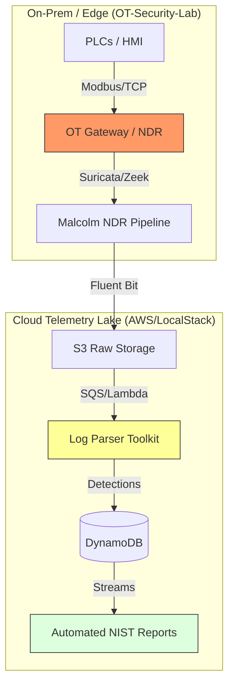

# Liam Carvajal

**OT/ICS Cybersecurity Engineer | Network Segmentation · IEC 62443 · Detection Engineering**

I design and defend security architectures for live industrial environments. My focus is the layer most security people skip: OT network architecture — zones and conduits, IT/OT segmentation and DMZ design, secure remote access, and detection that survives real plant constraints. I work across legacy industrial protocols (Modbus, PROFINET, DNP3, OPC UA, IEC 61850), OT NDR/SOC pipelines, and the brownfield reality of changing architecture in a running plant.

Currently **OT SOC Analyst @ Rockwell Automation** — industrial detection and incident response in production OT environments.

[LinkedIn](https://www.linkedin.com/in/liam-carvajal-perez/) · [Email](mailto:carvajalperezliam7@gmail.com) · Spain · **Open to EU remote & B2B / contract engagements**

---

## 🏗️ How an OT security architecture actually holds together

I don't stop at the standard or the slide deck. I build the pipelines that prove the design works — from edge protocol inspection to the SIEM, and from the cloud telemetry lake to the incident report.

---

## 🛡️ OT / ICS Security Architecture — Featured Work

### [OT-Security-Lab](https://github.com/LiamCarPer/OT-Security-Lab)
**The Problem:** You can't test attacks on live water treatment plants.
**The Solution:** A 5-zone Docker-based simulation of a water filtration facility mapped to the **Purdue Model** and **IEC 62443**, with every inter-zone conduit enforced through a dedicated iptables gateway.
*   **Architecture Judgment:** Isolated the Historian in Level 3 to enforce unidirectional data flow, fulfilling IEC 62443 requirements for zone-to-zone restricted access.
*   **GRC Depth:** Full IEC 62443 gap analysis, threat model mapped to MITRE ATT&CK for ICS (T0800–T0890), asset inventory, risk register & BIA (12 scenarios), IR playbook, and STIG-style hardening guides.
*   **Stack:** OpenPLC, Scada-LTS, Iptables (Zone Firewall), InfluxDB, Grafana, Docker Compose.

### [OT-NDR-Malcolm-Pipeline](https://github.com/LiamCarPer/OT-NDR-Malcolm-Pipeline)
**The Problem:** Commercial NDR (Nozomi/Claroty) is cost-prohibitive for many facilities.
**The Solution:** A production-grade NDR pipeline using CISA Malcolm, Arkime, and Suricata, enriched by a custom **Python SOAR layer**.
*   **Impact:** Implemented automated **DPI profiling** of Modbus function codes to identify unauthorized register manipulation before it hits the SIEM.
*   **Stack:** CISA Malcolm, Arkime, Suricata, Python (Scapy/Tshark).

### [ICS Agentic SOC Pipeline](https://github.com/LiamCarPer/ics-agentic-soc-pipeline)
**The Problem:** SOC analysts in OT environments drown in high-noise alerts. Generating NIST-aligned incident reports and Suricata rules manually is slow, inconsistent, and doesn't scale.
**The Solution:** An agentic AI pipeline that detects anomalies via Isolation Forest, enriches them with RAG-augmented OT knowledge (IEC 62443, asset inventories, past incidents), and produces NIST SP 800-61 reports with custom Suricata rules — all without human intervention.
*   **Engineering Challenge:** Built a deterministic classification layer that routes alerts to the correct analysis path before LLM invocation, eliminating token waste. Made the agent **LLM-agnostic** — swap between GPT-4o-mini and local Ollama models by changing two env vars.
*   **Stack:** Python, LangChain/LangGraph, ChromaDB, FastAPI, scikit-learn, OpenAI/OpenRouter, Pytest. 25 deterministic tests pass in CI without API keys.

### [Cloud Telemetry Lake](https://github.com/LiamCarPer/cloud-telemetry-lake)
**The Problem:** Ingesting OT telemetry into AWS is often rigid and expensive while respecting segmentation boundaries.
**The Solution:** A serverless, event-driven pipeline that ingests, parses, and archives OT security events in real-time.
*   **Engineering Challenge:** Solved LocalStack Community constraints by implementing a **Fat-Zip dependency injection** at cold-start and a **dynamic gzip detection** layer for Fluent Bit payloads.
*   **Stack:** Terraform, AWS Lambda, DynamoDB, S3, Snappy/Parquet, Fluent Bit.

### [Log Parser Toolkit](https://github.com/LiamCarPer/log-parser-toolkit)
**The Problem:** SIEM ingestion is only as good as its parser.
**The Solution:** A memory-efficient, stateful parsing engine for unstructured logs.
*   **Technical Nuance:** Uses the **Generator pattern** to process multi-gigabyte logs with near-zero RAM overhead. Features a stateful middleware for correlating SSH brute force and web scanning across time windows.

---

## 🦀 Rust & Systems Security Engineering

Where the OT work needs to go below the abstraction level, I build the tooling — memory-safe parsers and analyzers for industrial and on-chain environments.

### [Rust Security Toolkit](https://github.com/LiamCarPer/rust-security-toolkit)
A Rust CLI for Solana transaction forensics, IDL-aligned account validation, and instruction simulation — enabling rapid triage of suspicious on-chain activity.
*   **Stack:** Rust, Solana SDK, Anchor, Clap, Tokio. 56 integration tests.

### [Solana Audit Toolkit](https://github.com/LiamCarPer/solana-audit-toolkit)
A Rust-based static analyzer (syn) that detects missing signer checks, missing owner constraints, discriminator collisions, and CPI privilege escalation — plus a ProgramTest fuzzer with auto-generated invariants.
*   **Stack:** Rust, syn, Anchor, SPL Token, ProgramTest, Bankrun, SARIF. 40 tests, 3 shipped audit findings.

### Open Source Contributions
*   **[CISA Malcolm](https://github.com/cisagov/Malcolm)** — OT/ICS protocol visibility improvements for Modbus TCP within the DPI pipeline.
*   **[socketioxide](https://github.com/Totodore/socketioxide)** — volatile events support and remote-adapter core refactoring (merged PRs).
*   **[sqlx](https://github.com/transact-rs/sqlx)** — SQLite datetime format builder migrated off a deprecated API.

---

## 🧠 Applied AI for OT (Differentiator)

I use machine learning where it earns its place in OT — high-fidelity, physics-aware, and never at the cost of availability.

*   **[AetherPdM](https://github.com/LiamCarPer/AetherPdM)** — Predictive maintenance for rotating equipment: vibration DSP (FFT, envelope), PyTorch autoencoder anomaly detection that beat the sklearn baseline on real CWRU validation, MQTT streaming ingestion, and ONNX edge deployment.
*   **[GatedOps](https://github.com/LiamCarPer/GatedOps)** — Reference MLOps platform: gated train/evaluate/promote/serve with byte-exact lineage and serving-quality gates.

---

## 🧰 Technical Arsenal

**OT / ICS Security**
   
     

**Detection, Network & Response**
     

**Cloud & Infrastructure**
    

**Rust, Python & Systems**
    

**Applied ML & Data**
    

---

## 📈 Professional Development
*   **Certification path:** ISA/IEC 62443 Cybersecurity Fundamentals Specialist (IC32) → GICSP.
*   **Focus:** OT network architecture and segmentation at scale, secure remote access and identity in OT (AD/PAM), NIS2 / CRA compliance, and ICS adversary emulation (TRITON/Industroyer).

---

## 🤝 Let's Collaborate

My full-time focus is defending OT/ICS architectures; on the side I keep building open tooling at the intersection of OT security and applied AI. I'm open to connecting on joint research, open-source collaboration, and technical advisory for industrial security, segmentation, and detection challenges — as well as EU-remote and B2B / contract engagements.

[LinkedIn](https://www.linkedin.com/in/liam-carvajal-perez/) · [Email](mailto:carvajalperezliam7@gmail.com)
